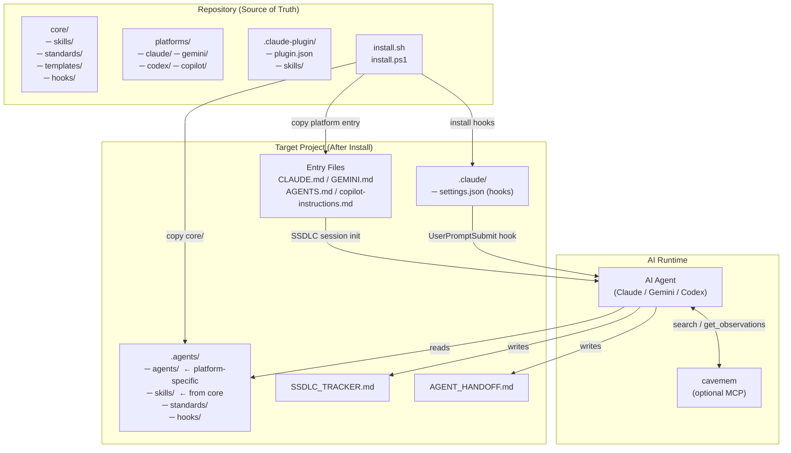
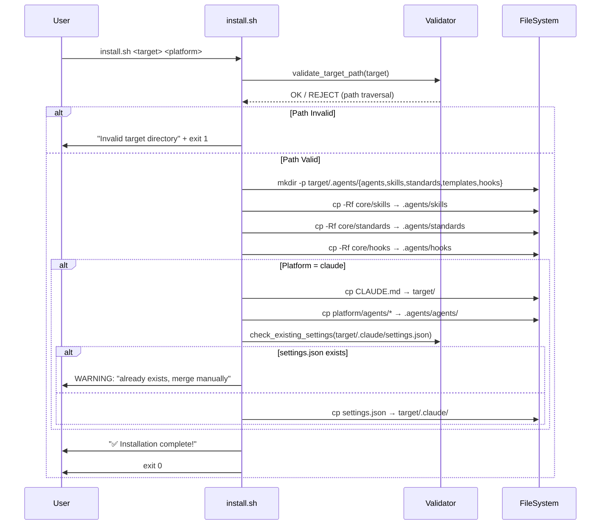
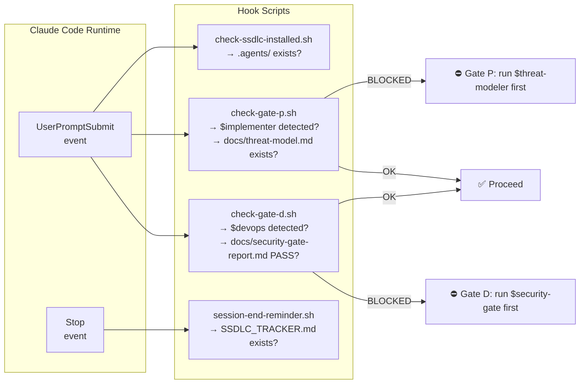
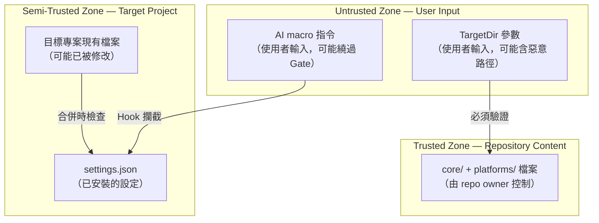

# SSDLC Autopilot — Architecture v1.0
> **Author**: $spec-architect  
> **Date**: 2026-05-19  
> **Input**: docs/requirements.md  
> **Status**: Gate P pending

---

## 1. 系統架構圖



---

## 2. 安裝流程架構圖



---

## 3. Hook 觸發鏈（Gate 執行機制）



---

## 4. 信任邊界分析 (Trust Boundaries)



**識別的信任邊界：**
1. **TB-01**: `TargetDir` 參數 → 檔案系統寫入（路徑遍歷風險）
2. **TB-02**: 使用者 macro 指令 → Agent 角色採用（Gate 繞過風險）
3. **TB-03**: 現有 settings.json → 安裝覆寫（設定損毀風險）
4. **TB-04**: `core/` 來源 → 目標複製（來源完整性風險）

---

## 5. 開放問題解決方案

### OI-002: Plugin 安裝後 .agents/agents/ 不存在問題

**決策**：Plugin skill 文件採用「嵌入 + 引用」雙模式：
- 嵌入模式：`.claude-plugin/skills/*.md` 包含完整 agent 行為描述（自給自足）
- 引用模式：如果 `.agents/agents/` 存在（完整安裝），優先讀取完整版

每個 plugin skill 文件更新為包含完整行為定義，`> 完整版：請參閱 .agents/agents/` 降為提示而非必要依賴。

---

## 6. 元件清單與職責

| 元件 | 路徑 | 職責 | 被誰依賴 |
|------|------|------|---------|
| Core Skills | `core/skills/` | 91 個 SKILL.md | 所有平台安裝 |
| Core Standards | `core/standards/` | SSDLC 規則、Agent 網絡定義 | AI Agent runtime |
| Core Hooks | `core/hooks/` | Session start/end 行為規範 | 安裝後的專案 |
| Platform Agents | `platforms/{p}/agents/` | 平台特定格式的 Agent 指令 | install 腳本 |
| Hook Scripts | `tests/hooks/` (新增) | Gate 前置條件 shell 腳本 | settings.json hooks |
| bats Tests | `tests/install/` (新增) | install.sh 行為驗證 | CI Pipeline |
| Ghost Skills | `platforms/{p}/agents/` (補完) | $deep-interview等4個 Agent | Claude/Gemini/Codex runtime |

---

## 7. 新增目錄結構（Phase 4 後）

```
agentic-skills/
├── core/
│   ├── hooks/
│   │   ├── session-start.md
│   │   ├── session-end.md
│   │   └── gate-checks/           ← 新增
│   │       ├── check-gate-p.sh
│   │       └── check-gate-d.sh
│   ├── skills/
│   └── standards/
├── docs/                          ← 新增
│   ├── requirements.md
│   ├── architecture.md
│   ├── threat-model.md
│   └── tasks.md
├── tests/                         ← 新增
│   ├── install/
│   │   ├── test_install_sh.bats
│   │   └── test_install_ps1.Tests.ps1
│   └── skills/
│       ├── pm.TESTS.md
│       ├── req-analyst.TESTS.md
│       └── ... (9 個)
├── platforms/
│   └── claude/
│       ├── agents/
│       │   ├── omni-deep-interview.md  ← 新增
│       │   ├── omni-ccg.md             ← 新增
│       │   ├── omni-ralph.md           ← 新增
│       │   └── omni-stack-advisor.md   ← 新增
│       └── hooks/
│           └── settings.json           ← 強化
└── .github/
    └── workflows/
        └── ci.yml                      ← 新增
```
